# SVSCH Syntax Book

This book contains generated block diagrams representing various SystemVerilog constructs.

## Ports

### Input Port

An input port declaration defines a module boundary input signal.

<pre><code>module top (
  input logic <mark>a</mark>,
  output logic y
);
  assign y = a;
endmodule
</code></pre>

  

### Output Port

An output port declaration defines a module boundary output signal.

<pre><code>module top (
  input logic a,
  output logic <mark>y</mark>
);
  assign y = a;
endmodule
</code></pre>

  

### Modport Port

A module port typed with a specific interface modport.

<pre><code><mark>interface simple_if;</mark>
  logic data;
  modport slave(input data);
endinterface
 
module top(simple_if.slave bus, output logic y);
  assign y = bus.data;
endmodule
</code></pre>

  

### Array Port

A module port declaration defining an array of signal vectors.

<pre><code>module top (
  input logic [7:0] <mark>a</mark> [0:1],
  output logic [7:0] y [0:1]
);
  assign y = a;
endmodule
</code></pre>

  

### Array Output Port

A module output port declaration defining an array of signal vectors.

<pre><code>module top (
  input logic [7:0] a [0:1],
  output logic [7:0] <mark>y</mark> [0:1]
);
  assign y = a;
endmodule
</code></pre>

  

### Inout Port

An inout port declaration defines a bidirectional module boundary signal, driven or read from either side.

<pre><code>module top (
  input logic drive_enable,
  inout wire <mark>a</mark>,
  output logic y
);
  assign a = drive_enable ? 1&#39;b1 : 1&#39;bz;
  assign y = a;
endmodule
</code></pre>

  

### Array Inout Port

An inout port declaration defining an array of bidirectional signal vectors.

<pre><code>module top (
  input logic [7:0] drive_enable [0:1],
  inout wire [7:0] <mark>a</mark> [0:1],
  output logic [7:0] y [0:1]
);
  assign a[0] = drive_enable[0] ? 8&#39;hff : 8&#39;hzz;
  assign a[1] = drive_enable[1] ? 8&#39;hff : 8&#39;hzz;
  assign y = a;
endmodule
</code></pre>

  

## Modules & Hierarchy

### Submodule Instance

Instantiating a submodule creates a hierarchical module instance block.

<pre><code>module top (
  input logic a,
  output logic b
);<mark>
  child u_child (.a(a), .b(b));</mark>
endmodule
</code></pre>

  

### Parameterized Submodule Instance

Instantiating a submodule with both default parameters and overridden values.

<pre><code>module child #(
  parameter WIDTH = 8,
  parameter DEPTH = 4
) (
  input logic [WIDTH-1:0] a,
  output logic [WIDTH-1:0] b
);
  assign b = a;
endmodule
 
module top (
  input logic [7:0] a,
  output logic [7:0] b
);<mark>
  child #(.WIDTH(8)) u_child (
    .a(a),
    .b(b)
  );</mark>
endmodule
</code></pre>

  

### Instance Array

Instantiating a submodule with a [MSB:LSB] range collapses the whole array into a single stacked instance node.

<pre><code>module top (
  input logic a [3:0],
  output logic b [3:0]
);
  child <mark>u_child</mark> [3:0] (
    .a (a),
    .b (b)
  );
endmodule
</code></pre>

  

### Function Call Block

Calling an automatic function renders the call site as a FUNCTION block; double-clicking it unfolds the function's own combinational body in place.

<pre><code>module top (
  input  logic [7:0] a,
  input  logic [7:0] b,
  output logic [7:0] y
);
  function automatic [7:0] foo(
    input [7:0] lhs,
    input [7:0] rhs
  );
    foo = lhs + rhs;
  endfunction
 
  assign y = <mark>foo(a, b)</mark>;
endmodule
</code></pre>

  

### Task Call Block

Calling an automatic task from a procedural block renders the call site as a TASK block, styled the same as a function call.

<pre><code>module top (
  input  logic [7:0] a,
  input  logic [7:0] b,
  output logic [7:0] y
);
  task automatic add_values(
    input  logic [7:0] lhs,
    input  logic [7:0] rhs,
    output logic [7:0] result
  );
    result = lhs + rhs;
  endtask
 
  always_comb begin
    <mark>add_values(a, b, y)</mark>;
  end
endmodule
</code></pre>

  

## Registers

### Register without Reset

A simple sequential register without any reset signal.

<pre><code>module top (
  input logic clk,
  input logic d,
  output logic q
);
  <mark>always_ff @(posedge clk) begin
    q &lt;= d;
  end</mark>
endmodule
</code></pre>

  

### Register with Reset

An always_ff register with an active-high reset signal.

<pre><code>module top (
  input logic clk,
  input logic rst,
  input logic d,
  output logic q
);
  <mark>always_ff @(posedge clk or posedge rst) begin
    if (rst) begin
      q &lt;= 1&#39;b0;
    end else begin
      q &lt;= d;
    end
  end</mark>
endmodule
</code></pre>

  

### Register with Inverted Reset

An always_ff register with an active-low (inverted) reset signal.

<pre><code>module top (
  input logic clk,
  input logic rst_n,
  input logic d,
  output logic q
);
  <mark>always_ff @(posedge clk or negedge rst_n) begin
    if (!rst_n) begin
      q &lt;= 1&#39;b0;
    end else begin
      q &lt;= d;
    end
  end</mark>
endmodule
</code></pre>

  

### Register with Reset Value

A register with a non-zero reset value.

<pre><code>module top (
  input logic clk,
  input logic rst_n,
  input logic [3:0] d,
  output logic [3:0] q
);
  <mark>always_ff @(posedge clk or negedge rst_n) begin
    if (!rst_n) begin
      q &lt;= 4&#39;hA;
    end else begin
      q &lt;= d;
    end
  end</mark>
endmodule
</code></pre>

  

### Multi-bit Register

A register storing a multi-bit vector.

<pre><code>module top (
  input logic clk,
  input logic [7:0] d,
  output logic [7:0] q
);
  <mark>always_ff @(posedge clk) begin
    q &lt;= d;
  end</mark>
endmodule
</code></pre>

  

### Array of Registers

A sequential register file representing an array of register cells.

<pre><code>module top (
  input logic clk,
  input logic [7:0] d [0:1],
  output logic [7:0] q [0:1]
);
  <mark>always_ff @(posedge clk) begin
    q &lt;= d;
  end</mark>
endmodule
</code></pre>

  

### Array Register with For-Loop Reset

A register array whose full-range for-loop reset folds into the array register's own reset, leaving the indexed write on a single write-address mux.

<pre><code>module top (
  input logic clk,
  input logic reset,
  input logic [1:0] address,
  input logic [7:0] in_data
);
  logic [7:0] storage [0:3];
  integer i;
 
  <mark>always_ff @(posedge clk) begin
    if (reset) begin
      for (i = 0; i &lt; 4; i = i + 1) storage[i] &lt;= 8&#39;b0;
    end else begin
      storage[address] &lt;= in_data;
    end
  end</mark>
endmodule
</code></pre>

  

## Muxes

### Case Statement Mux

A multiplexer inferred from a standard SystemVerilog case statement.

<pre><code>module top (
  input logic sel,
  input logic a,
  input logic b,
  output logic y
);
  always_comb begin
    <mark>case (sel)
      1&#39;b0: y = a;
      default: y = b;
    endcase</mark>
  end
endmodule
</code></pre>

  

### Mux with Complex Case Arm

A multiplexer inferred from a case statement with multiple matching selector values on a single case arm.

<pre><code>module top (
  input logic [1:0] sel,
  input logic a,
  input logic b,
  output logic y
);
  always_comb begin
    <mark>case (sel)
      2&#39;b00, 2&#39;b01: y = a;
      default: y = b;
    endcase</mark>
  end
endmodule
</code></pre>

  

### Ternary Operator Mux

A conditional expression becomes a two-way multiplexer.

<pre><code>module top (
  input logic sel,
  input logic a,
  input logic b,
  output logic y
);
  <mark>assign y = sel ? a : b;</mark>
endmodule
</code></pre>

  

### Array Ternary Mux

A conditional expression selecting between arrays becomes a stacked multiplexer.

<pre><code>module top (
  input logic sel,
  input logic [7:0] a [0:1],
  input logic [7:0] b [0:1],
  output logic [7:0] y [0:1]
);
  <mark>assign y = sel ? a : b;</mark>
endmodule
</code></pre>

  

### Nested Ternary Muxes

Nested conditional expressions become cascaded two-way multiplexers.

<pre><code>module top (
  input logic sel1,
  input logic sel2,
  input logic a,
  input logic b,
  input logic c,
  output logic y
);
  assign y = sel1 ? (<mark>sel2 ? a : b</mark>) : c;
endmodule
</code></pre>

  

### Ternary Inside an Arithmetic Expression

A conditional subexpression becomes a mux feeding its containing ALU.

<pre><code>module top (
  input logic sel,
  input logic a,
  input logic b,
  input logic c,
  output logic y
);
  assign y = a + (<mark>sel ? b : c</mark>);
endmodule
</code></pre>

  

### Variable Index Selection

Indexing a bus with a variable index signal becomes a select block.

<pre><code>module top (
  input logic [3:0] bus,
  input logic [1:0] sel,
  output logic bit_out
);
  assign bit_out = bus[<mark>sel</mark>];
endmodule
</code></pre>

  

### Variable Index Selection with Width

Indexing a bus with a variable index and a constant width (using +: syntax) becomes a select block.

<pre><code>module top (
  input logic [15:0] bus,
  input logic [2:0] sel,
  output logic [7:0] byte_out
);
  assign byte_out = bus[<mark>sel * 8 +: 8</mark>];
endmodule
</code></pre>

  

## Combinational Logic

### Combinational Expression

A combinational logic assignment expression that isn't a specialized shape becomes a generic combinational block.

<pre><code>module top (
  input logic a,
  input logic b,
  output logic decoded
);
  <mark>assign decoded = a * b;</mark>
endmodule
</code></pre>

  

### Boolean AND Gate

A bitwise AND operator becomes an AND gate.

<pre><code>module top (
  input logic a,
  input logic b,
  output logic decoded
);
  assign decoded = <mark>a &amp; b</mark>;
endmodule
</code></pre>

  

### N-ary NAND Gate

Negating an AND chain of the same operator fuses into one n-input NAND gate with a negated-output bubble, instead of a separate inverter feeding a chain of 2-input ANDs.

<pre><code>module top (
  input logic a,
  input logic b,
  input logic c,
  output logic y
);
  assign y = <mark>~(a &amp; b &amp; c)</mark>;
endmodule
</code></pre>

  

### Multi-bit Boolean AND Gate

A bitwise AND over multi-bit vectors reuses the same AND gate glyph as the single-bit case; only the connecting wires render thicker to signal the wider width.

<pre><code>module top (
  input logic [3:0] a,
  input logic [3:0] b,
  output logic [3:0] decoded
);
  assign decoded = <mark>a &amp; b</mark>;
endmodule
</code></pre>

  

### Logical AND Gate

The logical AND operator (&&) reduces each operand to a boolean value first, so it renders with the same AND gate glyph as bitwise AND but always produces a single-bit result, even over multi-bit operands.

<pre><code>module top (
  input logic [3:0] a,
  input logic [3:0] b,
  output logic y
);
  assign y = <mark>a &amp;&amp; b</mark>;
endmodule
</code></pre>

  

### Boolean OR Gate

A bitwise OR operator becomes an OR gate.

<pre><code>module top (
  input logic a,
  input logic b,
  output logic decoded
);
  assign decoded = <mark>a | b</mark>;
endmodule
</code></pre>

  

### Logical OR Gate

The logical OR operator (||) reduces each operand to a boolean value first, so it renders with the same OR gate glyph as bitwise OR but always produces a single-bit result, even over multi-bit operands.

<pre><code>module top (
  input logic [3:0] a,
  input logic [3:0] b,
  output logic y
);
  assign y = <mark>a || b</mark>;
endmodule
</code></pre>

  

### Boolean XOR Gate

A bitwise XOR operator becomes an XOR gate.

<pre><code>module top (
  input logic a,
  input logic b,
  output logic decoded
);
  assign decoded = <mark>a ^ b</mark>;
endmodule
</code></pre>

  

### Boolean NOR Gate

Negating an OR expression fuses into a single NOR gate with a negated-output bubble, instead of a separate inverter feeding an OR gate.

<pre><code>module top (
  input logic a,
  input logic b,
  output logic y
);
  assign y = <mark>~(a | b)</mark>;
endmodule
</code></pre>

  

### Boolean XNOR Gate

A bitwise XNOR operator becomes an XNOR gate with a negated-output bubble.

<pre><code>module top (
  input logic a,
  input logic b,
  output logic y
);
  assign y = <mark>a ^~ b</mark>;
endmodule
</code></pre>

  

### Arithmetic Addition

An arithmetic addition operator becomes an ALU block.

<pre><code>module top (
  input logic a,
  input logic b,
  output logic y
);
  assign y = <mark>a + b</mark>;
endmodule
</code></pre>

  

### Less-Than Comparator

A less-than operator becomes a comparator block, whose output is always 1 bit regardless of operand width.

<pre><code>module top (
  input logic a,
  input logic b,
  output logic y
);
  assign y = <mark>a &lt; b</mark>;
endmodule
</code></pre>

  

### Less-Than-or-Equal Comparator

A less-than-or-equal operator becomes a comparator block.

<pre><code>module top (
  input logic a,
  input logic b,
  output logic y
);
  assign y = <mark>a &lt;= b</mark>;
endmodule
</code></pre>

  

### Greater-Than Comparator

A greater-than operator becomes a comparator block.

<pre><code>module top (
  input logic a,
  input logic b,
  output logic y
);
  assign y = <mark>a &gt; b</mark>;
endmodule
</code></pre>

  

### Greater-Than-or-Equal Comparator

A greater-than-or-equal operator becomes a comparator block.

<pre><code>module top (
  input logic a,
  input logic b,
  output logic y
);
  assign y = <mark>a &gt;= b</mark>;
endmodule
</code></pre>

  

### Equality Comparator

An equality operator becomes a comparator block.

<pre><code>module top (
  input logic a,
  input logic b,
  output logic y
);
  assign y = <mark>a == b</mark>;
endmodule
</code></pre>

  

### Inequality Comparator

An inequality operator becomes a comparator block.

<pre><code>module top (
  input logic a,
  input logic b,
  output logic y
);
  assign y = <mark>a != b</mark>;
endmodule
</code></pre>

  

### Case Equality Comparator

A case-equality operator becomes a comparator block.

<pre><code>module top (
  input logic a,
  input logic b,
  output logic y
);
  assign y = <mark>a === b</mark>;
endmodule
</code></pre>

  

### Case Inequality Comparator

A case-inequality operator becomes a comparator block.

<pre><code>module top (
  input logic a,
  input logic b,
  output logic y
);
  assign y = <mark>a !== b</mark>;
endmodule
</code></pre>

  

### Zero-Extension

A case arm whose driving signal is narrower than the mux's resolved output width gets an explicit zero-extension block inserted between the source and the mux input, instead of silently implying a same-width connection.

<pre><code>module top (
  input logic [1:0] sel,
  input logic a,
  input logic b,
  output logic [7:0] y
);
  always_comb begin
    <mark>case (sel)
      2&#39;b00: y = (a &lt; b);
      default: y = 8&#39;h00;
    endcase</mark>
  end
endmodule
</code></pre>

  

### Bitwise Inversion

A bitwise NOT operator becomes an inverter gate.

<pre><code>module top (
  input logic a,
  output logic y
);
  <mark>assign y = ~a;</mark>
endmodule
</code></pre>

  

### Latch Inference

An incomplete conditional assignment inside always_comb infers a latch.

<pre><code>module top (
  input logic enable,
  input logic d,
  output logic q
);
  <mark>always_comb begin
    if (enable) begin
      q = d;
    end
  end</mark>
endmodule
</code></pre>

  

### Literal Value

A literal constant expression becomes a literal block.

<pre><code>module top (
  output logic [3:0] y
);
  assign y = <mark>4&#39;b1010</mark>;
endmodule
</code></pre>

  

### Replicate Expression

Replicating a signal with a multiplier value becomes a replicate block.

<pre><code>module top (
  input logic some_wire,
  output logic [19:0] repeated
);
  assign repeated = <mark>{20{some_wire}</mark>};
endmodule
</code></pre>

  

### For Loop Block

A procedural for loop becomes a loop block.

<pre><code>module top (
  input logic [3:0] in,
  output logic [3:0] out
);
  always_comb begin
    out = 4&#39;b0;
    <mark>for</mark> (int i = 0; i &lt; 4; i++) begin
      out[i] = in[i];
    end
  end
endmodule
</code></pre>

  

## Wiring

### Unnamed Net

A direct assignment between ports has nothing more to say about the net than the two ports already show, so no label appears on the wire. Since there's no wire declared for it either, cutting this net still leaves it freely renameable.

<pre><code>module top (
  input logic a,
  output logic y
);
  assign y = a;
endmodule
</code></pre>

  

### Named Net

An explicitly declared internal wire is cut automatically on first open, with its declared name labeling both cut ends.

<pre><code>module top (
  input logic a,
  output logic y
);
  wire x;
  assign x = a;
  assign y = x;
endmodule
</code></pre>

  

### Multiple Aliases

A chain of assigns through several named wires collapses into one automatically cut net. The first-declared wire names both cut ends; any other internal wire name it passed through (but not the ports at either end, which are already visible) shows up on hover over the asterisk.

<pre><code>module top (
  input logic a,
  output logic y
);
  wire x1, x2;
  assign x1 = a;
  assign x2 = x1;
  assign y = x2;
endmodule
</code></pre>

  

## Buses

### Bus Concatenation

Concatenating signals forms a bus block.

<pre><code>module top (
  input logic a,
  input logic b,
  output logic [1:0] y
);
  assign y = <mark>{a, b}</mark>;
endmodule
</code></pre>

  

### Bus Composition (Three Wires)

Composing a bus from three single-bit signals.

<pre><code>module top (
  input logic a,
  input logic b,
  input logic c,
  output logic [2:0] y
);
  assign y = <mark>{a, b, c}</mark>;
endmodule
</code></pre>

  

### Bus Composition (One Single, One Multi-bit)

Composing a bus from a single-bit signal and a multi-bit slice.

<pre><code>module top (
  input logic a,
  input logic [3:0] b,
  output logic [2:0] y
);
  assign y = <mark>{a, b[1:0]}</mark>;
endmodule
</code></pre>

  

### Simple Bus Breakout

Breaking out a single bit signal from a bus.

<pre><code>module top (
  input logic [3:0] bus,
  output logic y
);
  assign <mark>y = bus[0]</mark>;
endmodule
</code></pre>

  

### Bus Breakout (Three Wires)

Breaking out three individual bit signals from a bus.

<pre><code>module top (
  input logic [3:0] bus,
  output logic x,
  output logic y,
  output logic z
);
  assign <mark>x = bus[0]</mark>;
  assign y = bus[1];
  assign z = bus[2];
endmodule
</code></pre>

  

### Bus Breakout (One Single, One Multi-bit)

Breaking out a single bit signal and a multi-bit slice from a bus.

<pre><code>module top (
  input logic [7:0] bus,
  output logic x,
  output logic [2:0] y
);
  assign <mark>x = bus[0]</mark>;
  assign y = bus[3:1];
endmodule
</code></pre>

  

### Array Composition

Composing an array of busses from individual bus elements.

<pre><code>module top (
  input logic [7:0] a,
  input logic [7:0] b,
  output logic [7:0] y [0:1]
);
  assign <mark>y[0]</mark> = a;
  assign y[1] = b;
endmodule
</code></pre>

  

### Array Breakout

Breaking out individual bus elements from an array of busses.

<pre><code>module top (
  input logic [7:0] bus [0:1],
  output logic [7:0] y0,
  output logic [7:0] y1
);
  assign <mark>y0 = bus[0]</mark>;
  assign y1 = bus[1];
endmodule
</code></pre>

  

## Structs

### Struct Composition

Assigning to individual struct fields forms a struct composition node.

<pre><code>module top (
  input logic [3:0] opcode_i,
  input logic valid_i,
  output logic [4:0] flat
);
  typedef struct packed {
    logic [3:0] opcode;
    logic valid;
  } packet_t;
  packet_t <mark>pkt</mark>;
  assign pkt.opcode = opcode_i;
  assign pkt.valid = valid_i;
  assign flat = pkt;
endmodule
</code></pre>

  

### Struct Breakout

Breaking out fields from a packed struct.

<pre><code>typedef struct packed {
  logic [3:0] opcode;
  logic valid;
  logic [1:0] lane;
} packet_t;
 
module top(
  input packet_t <mark>pkt</mark>,
  output logic [3:0] opcode,
  output logic valid,
  output logic [1:0] lane
);
  assign opcode = pkt.opcode;
  assign valid = pkt.valid;
  assign lane = pkt.lane;
endmodule
</code></pre>

  

## Interfaces

### Interface Instantiation

Instantiating an interface block and connecting it becomes an interface node.

<pre><code><mark>interface simple_if(input logic clk);</mark>
  logic data;
  modport master(input clk, output data);
  modport slave(input clk, input data);
endinterface
 
module producer(simple_if.master bus);
  assign bus.data = 1&#39;b1;
endmodule
 
module consumer(simple_if.slave bus, output logic observed);
  assign observed = bus.data;
endmodule
 
module top(input logic clk, output logic observed);
  simple_if link(clk);
  producer u_producer(.bus(link));
  consumer u_consumer(.bus(link), .observed(observed));
endmodule
</code></pre>

  

### Interface Modports on One Side

An interface block with all modports explicitly laid out on the left side using position comments.

<pre><code><mark>interface stream_if(input logic clk);</mark>
  logic data;
  // svsch:modport:pos=left
  modport producer(input clk, output data);
  // svsch:modport:pos=left
  modport consumer(input clk, input data);
endinterface
 
module producer_mod(stream_if.producer bus);
  assign bus.data = 1&#39;b1;
endmodule
 
module consumer_mod(stream_if.consumer bus);
endmodule
 
module top(input logic clk);
  stream_if stream(clk);
  producer_mod u_prod(.bus(stream));
  consumer_mod u_cons(.bus(stream));
endmodule
</code></pre>

  

### Interface Modports on Both Sides

An interface block with modports distributed on both sides.

<pre><code><mark>interface stream_if(input logic clk);</mark>
  logic data;
  // svsch:modport:pos=left
  modport producer(input clk, output data);
  // svsch:modport:pos=right
  modport consumer(input clk, input data);
endinterface
 
module producer_mod(stream_if.producer bus);
  assign bus.data = 1&#39;b1;
endmodule
 
module consumer_mod(stream_if.consumer bus);
endmodule
 
module top(input logic clk);
  stream_if stream(clk);
  producer_mod u_prod(.bus(stream));
  consumer_mod u_cons(.bus(stream));
endmodule
</code></pre>

  

## Generate Blocks

### Generate If

A conditional generate block using an if-else statement.

<pre><code>module child_a (input logic in, output logic out);
  assign out = in;
endmodule
 
module child_b (input logic in, output logic out);
  assign out = ~in;
endmodule
 
module top #(
  parameter MODE = 0
) (
  input logic a,
  input logic b,
  output logic y
);
  generate
    <mark>if (MODE == 0) begin : g_if_a
      child_a u_child_a (.in(a), .out(y));
    end else begin : g_if_b
      child_b u_child_b (.in(b), .out(y));
    end</mark>
  endgenerate
endmodule
</code></pre>

  

### Generate Case

A conditional generate block using a case statement.

<pre><code>module child_a (input logic in, output logic out);
  assign out = in;
endmodule
 
module child_b (input logic in, output logic out);
  assign out = ~in;
endmodule
 
module top #(
  parameter MODE = 1
) (
  input logic a,
  input logic b,
  output logic y
);
  generate
    <mark>case (MODE)
      0: begin : g_case_a
        child_a u_child_a (.in(a), .out(y));
      end
      1: begin : g_case_b
        child_b u_child_b (.in(b), .out(y));
      end
      default: begin : g_case_def
        assign y = a &amp; b;
      end
    endcase</mark>
  endgenerate
endmodule
</code></pre>

  

## Other

### Unknown Construct

An unsupported procedural block is rendered as an unknown node.

<pre><code>module top (
  input logic a,
  output logic y
);
  assign y = a;
  <mark>initial begin
    $display(&quot;hello&quot;);
  end</mark>
endmodule
</code></pre>

  

